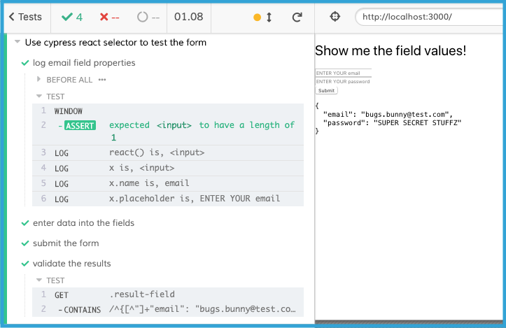

## Example of using `cypress-react-selector` with `Formik`

The goal of this project is to give an example of how to use `cy.react()` with a non-trivial but commonly used set of React components.

### Run this example
1. `git clone https://github.com/gregfenton/example-cypress-react-selector-formik.git`
1. `cd example-cypress-react-selector-formik`
1. `npm install`
1. In one console, run: `npm start`
1. In another console, run:  `$(npm bin)/cypress open`
1. When the Cypress window opens, click to run the test __form_spec.js__

### Dependencies
See `package.json` at the root of this project.

This project was bootstrapped with [Create React App](https://github.com/facebook/create-react-app).
